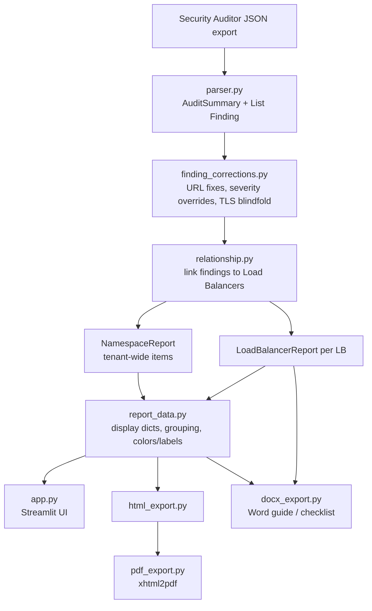

# Architecture

How the XC Security Report Generator is put together, and the reasoning behind
the non-obvious parts.

## Data flow

Corrections run **once**, immediately after parsing, so every downstream
consumer (dashboard, HTML, PDF, Word, health score) sees an identical,
corrected dataset.

## Modules

| Module | Responsibility |
|---|---|
| `parser.py` | Validate + parse the raw JSON into `AuditSummary` and a flat `List[Finding]`. |
| `models.py` | Dataclasses: `Finding`, `AuditSummary`, `LoadBalancerReport`, `NamespaceReport`. |
| `finding_corrections.py` | Post-parse mutations: broken-URL replacement, per-rule severity overrides, TLS-blindfold status from the manual checklist. Original auditor status/message is preserved on the finding. |
| `relationship.py` | Attach each finding to the LB it belongs to; everything tenant-wide or unlinkable goes to the `NamespaceReport`. |
| `report_data.py` | Turn model objects into plain display data; owns status colors, the `REVIEW`/`CAUTION` display labels, and severity grouping. |
| `policy_type.py` | Heuristics for what a service policy is *for* (naming-convention based) and whether a check applies. |
| `product_entitlements.py` | Gate findings by purchased products so unpurchased features read as opportunities, not failures. |
| `manual_checklist.py` | Items the auditor cannot detect (console IP restriction, synthetic monitoring, …). |
| `html_export.py` | Self-contained HTML report (inline CSS, no external assets). |
| `pdf_export.py` | Convert the HTML to PDF via xhtml2pdf; adds the F5 cover page, headers/footers, and row coloring. |
| `docx_export.py` | Word best-practice guide (generic checklist + per-report appendix) and the generic-only customer checklist. |
| `app.py` | The Streamlit UI tying it all together. |
| `main.py` / `analyzer.py` | CLI helpers for sanity-checking and inspecting an export. |

## Relationship linking (why it isn't trivial)

The Security Auditor JSON is a flat list of findings, not a resource graph. In
the v2 export each finding carries a `loadBalancer` field, so most findings link
directly to their LB. Anything that is genuinely tenant-wide — alert policies,
global log receivers, and WAF findings that aren't tied to a single LB — is
routed to the `NamespaceReport` rather than being dropped or duplicated.

Health-check findings were a special case: `HC-01` reports
`objectType: "healthcheck"` (not `origin_pool`), so it was originally missed
during categorization. `relationship.py` now checks for the healthcheck type /
`HC-01` rule id explicitly before the origin-pool branch.

## Report tab structure

Per-Load-Balancer reports are organized (in `app.py`, mirrored in
`html_export.py`) as:

1. **Severity tabs** — High / Medium / Low, containing only actionable
   (REVIEW/CAUTION) findings.
2. **Category tabs** — TLS, Certificates, Origin Pools, Health Check, WAF
   Configuration, WAF Policy Details, Bot Defense, API Protection, Malware
   Detection, DDoS, Client-Side Defense, Service Policies, Rate Limiting, IP
   Reputation.
3. **Informational / Baseline Compliance** — INFO/SKIP and PASS findings that
   don't belong to a category tab.
4. **Tenant-Wide Context / Additional Opportunities**.

Because the two files must agree, any change to tab membership has to be applied
in **both** `app.py` and `html_export.py`.

## Status labels & colors

`report_data.py` is the single source of truth:

- `status_display_label()` maps auditor values to customer wording:
  `FAIL -> REVIEW`, `WARN -> CAUTION`. PASS/INFO/SKIP are shown as-is.
- `status_badge_color()` drives color: PASS green, REVIEW red (shaded by
  severity), CAUTION orange, INFO/SKIP neutral.

The UI, HTML, PDF, and Word all call these helpers so wording and color never
drift between surfaces.

## Anonymizing a real export (for the sample)

`input/security-audit.sample.json` is produced from a real export by:

1. Building consistent replacement maps for tenant, namespaces, LB names, object
   names, and `objectKey` name-parts (mapped to synthetic values like `lb-01`,
   `origin-pool-03`).
2. Applying those replacements across the whole serialized JSON (longest tokens
   first) so identifiers embedded in messages/config are caught too.
3. Regex-scrubbing IPv4 addresses and email addresses.
4. Fixing `id`/`timestamp` to constant demo values.
5. Verifying no known customer tokens remain and the app still parses/renders.

Keep this process in mind before refreshing the sample — the real export must
never be committed.

## Known constraints

- **PDF engine:** xhtml2pdf only (WeasyPrint requires GTK/Pango, unavailable on
  Windows). This constrains the CSS the HTML can use.
- **No automated tests yet** — validate via `main.py` + a manual app smoke test.
- **Service-policy purpose and origin-pool matching** rely on naming
  conventions; they are always labeled as heuristic and are overridable in the
  UI.
